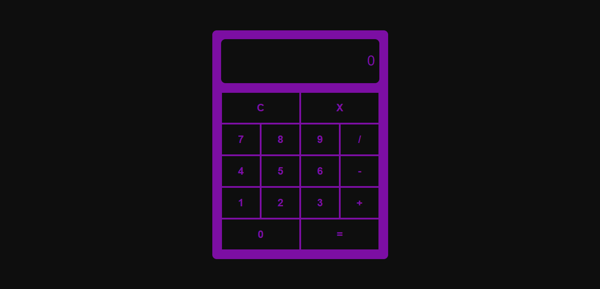
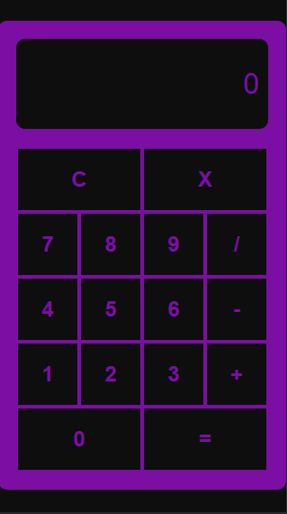

# Calculadora

Calculadora desenvolvida com os conhecimentos adquiridos no módulo de React do Bootcamp Orange Tech+, da DIO.

----

## 👩‍💻 O Projeto

Nos foi proposto que criássemos uma calculadora em React, utilizando os conhecimentos adquiridos durante as aulas com o acompanhamento do professor Pablo Henrique. Podíamos também fazer estilizações próprias.

----

## 🔧 Tecnologias Usadas
- HTML
- JSX
- React
- Styled Components

----

## 🔗 Acesso 

Para acessar a Calculadora, basta <a href="#">clicar aqui</a>!

----

##  📱 Demo

| Versão Desktop | Versão Mobile |
| ---------------| --------------|
|||